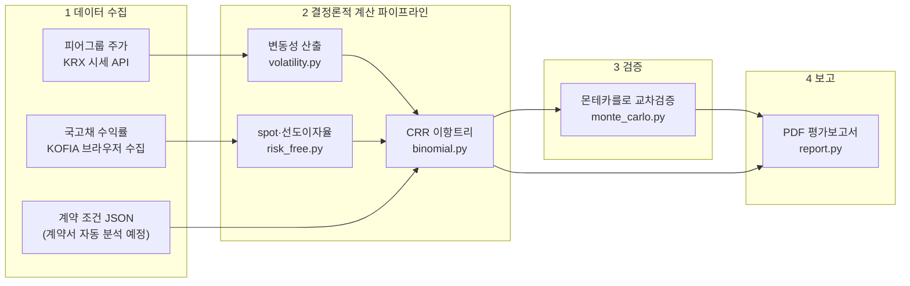

# 이항모형 기반 밸류에이션 자동화 (Binomial Model Valuation Automation)

이항모형(Binomial Option Pricing Model)을 파이썬으로 구현하여 옵션성 증권의 가치평가(밸류에이션)를 자동화하는 프로젝트입니다.

전환사채(CB), 상환전환우선주(RCPS) 등 옵션이 내재된 메자닌 증권의 공정가치 평가는 실무에서 주로 엑셀로 수행되지만, 단위기간이 촘촘해지거나(트리 스텝 수 증가) 전환가액 조정(리픽싱)·조기상환권 같은 복잡한 조건이 붙으면 엑셀로는 관리가 어렵고 느려집니다. 이 프로젝트는 평가 로직을 파이썬 코드로 구현하여 **빠르고, 검증 가능하고, 확장 가능한 평가 파이프라인**을 만드는 것을 목표로 합니다.

## 자동화 아키텍처

이 프로젝트는 "사람은 판단만, 수집·계산·문서화는 자동"을 지향하는 **에이전틱 워크플로(Agentic Workflow)** 로 설계되어 있습니다. AI 에이전트(Claude Code)가 스킬에 정의된 표준 절차에 따라 전체 흐름을 조율하고, 모든 수치 계산은 재현 가능한 파이썬 파이프라인이 결정론적으로 수행합니다. **AI는 절차의 조율과 서술을 담당할 뿐, 평가 수치는 전부 검증된 코드가 계산합니다.**



### 계층별 구성

**1. 데이터 수집 계층 (Data Acquisition)** — 평가에 필요한 시장 데이터를 자동으로 확보합니다.

| 데이터 | 수집 방식 | 구현 위치 |
|--------|-----------|-----------|
| 피어그룹 주가 (변동성 산출용) | **API 연동** — FinanceDataReader로 KRX 일별 종가를 자동 수집 (5개사 1년치 약 4초) | `valuation/volatility.py` |
| 국고채 수익률 (무위험이자율용) | **무료 공개 데이터 직접 호출** — Seibro(한국예탁결제원) 채권만기수익률을 HTTP 요청으로 자동 수집 (API 키·브라우저·토큰 불필요, 휴일 자동 소급). KOFIA는 WAF가 스크립트를 차단하여 에이전트 **브라우저 자동화**를 폴백으로 유지 | `valuation/seibro.py` / 스킬 2-B-a(폴백) |
| 계약 조건 | 정형 JSON 입력 (향후 계약서 문서에서 **정보 추출**로 자동화 예정) | `data/*.json` |

**2. 계산 계층 (Deterministic Computation)** — 모듈들이 데이터 계약(JSON)으로 연결된 파이프라인입니다.

```
피어 주가 ──→ 로그수익률 ──→ 연환산 변동성 평균 ──┐
                                                  ├──→ CRR 이항트리 ──→ 1주당 가치 × 수량
국고채 YTM ──→ spot 부트스트래핑 ──→ 선도이자율 ──┘    (스텝별 확률·할인)
```

각 모듈의 산출물이 다음 모듈에 무손실로 전달되는 것을 자동 테스트(pytest 53개)와 독립 재계산 진단으로 보증합니다. 같은 입력이면 언제나 같은 결과가 나옵니다(난수 시드 고정 포함).

**3. 검증 계층 (Verification)** — 계산 구조가 전혀 다른 몬테카를로 시뮬레이션으로 독립 재계산하여 95% 신뢰구간 합격 기준으로 판정하고, Black-Scholes 수렴·풋-콜 패리티 테스트가 상시 실행됩니다.

**4. 보고 계층 (Reporting)** — 결과 JSON만을 수치 원천으로 삼아 PDF 평가보고서를 생성합니다. 가정·산출 근거·데이터 출처가 보고서에 상세 기재되며, AI는 서술문만 작성하고 숫자를 만들어내지 않습니다.

### AI 기술 용어 정리

| 용어 | 의미 | 이 프로젝트에서의 적용 |
|------|------|------------------------|
| 에이전틱 워크플로 (Agentic Workflow) | AI 에이전트가 도구를 사용하며 다단계 작업을 자율 수행하는 방식 | 스킬에 정의된 6단계 평가 절차를 에이전트가 조율 |
| 스킬 (Skill) | 에이전트에게 부여하는 표준작업절차(SOP) 문서 | `.claude/skills/valuation-report/SKILL.md` |
| API 연동 (API Integration) | 프로그램 간 정해진 규약으로 데이터를 요청·응답 | FinanceDataReader → KRX 피어 주가 수집 |
| 브라우저 자동화 (Browser Automation) | 에이전트가 실제 브라우저를 조작해 화면의 데이터를 수집 | KOFIA 국고채 수익률 수집 (API 부재 대응) |
| 결정론적 파이프라인 (Deterministic Pipeline) | 같은 입력이면 항상 같은 출력을 내는 계산 체인 | `valuation/` 파이썬 모듈 전체 — LLM의 확률적 생성과 분리 |
| 데이터 계약 (Data Contract) | 모듈 간 주고받는 데이터의 형식 약속 | 계약·입력·결과 JSON 구조 |
| 교차검증 (Cross-validation) | 독립적인 방법으로 같은 값을 재계산해 신뢰성 확보 | 이항트리 vs 몬테카를로 (95% CI 판정) |
| 휴먼인더루프 (Human-in-the-loop) | 핵심 판단 지점에 사람의 확인·승인을 배치 | 계약정보 확인, 주요 가정 승인 후 평가 진행 |
| 문서 정보 추출 (Document Extraction) | 비정형 문서에서 정형 데이터를 뽑아내는 기술 | (예정) 계약서 PDF → 계약정보 JSON 자동 추출 |
| 구조화 출력 (Structured Output) | LLM의 출력을 정해진 스키마(JSON)로 강제하는 기법 | (예정) 계약서 분석 에이전트의 추출 결과 형식 |

## 대시보드 (웹 인터페이스)

```bash
streamlit run app.py
```

좌측에 계약조건(직접 입력 또는 계약정보 JSON 첨부)·평가 주요변수·피어그룹·계산 설정을 입력하고
**가치평가 실행**을 누르면, 우측 미리보기 패널에 핵심 지표(1주당 가치·총 평가액·교차검증)와
평가보고서 미리보기, 변동성·선도이자율 산출 내역, 민감도 분석이 표시되며
결과 JSON(계산 과정)과 PDF 평가보고서를 바로 내려받을 수 있습니다.

## 이론적 배경: CRR 이항모형

Cox-Ross-Rubinstein(1979) 모형은 기초자산(주가)이 매 단위기간 `dt`마다 일정 배수로 상승(`u`)하거나 하락(`d`)한다고 가정하고, 위험중립확률(`q`)로 만기 페이오프의 기대값을 역방향으로 할인하여 현재 가치를 구합니다.

| 기호 | 의미 |
|------|------|
| `s0` | 평가기준일 현재 주가 |
| `sigma` | 주가 변동성 (연환산) |
| `maturity` | 만기까지 기간 (연 단위) |
| `steps` | 트리 스텝 수 (`dt = maturity / steps`) |
| `rf` | 무위험이자율 (연속복리) |
| `K` | 행사가격 (전환가액 등) |

핵심 수식:

```
u = exp(sigma · √dt)                # 주가 상승배수
d = 1 / u                           # 주가 하락배수
q = (exp(rf · dt) − d) / (u − d)    # 위험중립확률
할인계수 = exp(−rf · dt)            # 위험중립확률과 동일한 복리 기준으로 할인
```

스텝 수(`steps`)를 늘릴수록 계산 결과는 Black-Scholes 해석해에 수렴하며, 이 성질은 구현 검증(수렴 테스트)에 사용합니다.

## 설계 원칙

교과서적 구현(2차원 트리 행렬 + 이중 for문)은 이해하기 쉽지만 실무 자동화에는 비효율적이고 오류에 취약합니다. 이 프로젝트는 다음 원칙으로 구현합니다.

**1. 벡터화된 역방향 귀납 — 트리 행렬을 만들지 않는다**

`(T+1) × (T+1)` 행렬에 셀 단위로 값을 채우는 대신, 만기 시점의 주가 배열(길이 `T+1`)에서 출발해 한 스텝씩 배열 연산으로 뒤로 이동합니다. 메모리는 O(T²) → O(T)로 줄고, 파이썬 루프 대신 numpy 연산을 쓰므로 스텝 수가 수천 단위여도 빠르게 계산됩니다. 다만 리픽싱처럼 경로별 조건이 필요한 경우에는 전체 트리를 명시적으로 보관하는 모드를 별도로 지원합니다.

**2. 복리 기준의 일관성 — 확률과 할인은 같은 금리 관행을 쓴다**

위험중립확률을 `exp(rf·dt)`(연속복리)로 계산했다면 할인도 반드시 `exp(−rf·dt)`로 해야 합니다. 확률은 연속복리로 만들고 할인은 `1/(1+rf)`(이산복리)로 하는 식의 혼용은 스텝 수가 커질수록 평가오차를 누적시키는 흔한 실수이므로, 금리 관행을 파라미터 객체 한 곳에서 강제합니다.

**3. 입력 검증 — 잘못된 입력은 계산 전에 실패시킨다**

변동성·기간·스텝 수의 양수 조건과 무차익거래 조건(`d < exp(rf·dt) < u`, 즉 `0 < q < 1`)을 파라미터 생성 시점에 검증합니다. 조건 위반 시 잘못된 평가액을 조용히 내놓는 대신 즉시 예외를 발생시킵니다.

**4. 페이오프의 분리 — 모형과 증권 조건을 결합하지 않는다**

트리 계산 엔진은 페이오프 함수를 인자로 받도록 분리합니다. 콜/풋, 유럽형/미국형은 물론 전환권·상환권·조기상환권이 얽힌 CB/RCPS 페이오프도 엔진 수정 없이 함수 교체만으로 평가할 수 있게 합니다.

## 핵심 로직 설계

위 원칙을 반영한 가격결정 엔진의 골격입니다. (실제 구현은 `valuation/`에서 단계적으로 진행)

```python
from dataclasses import dataclass
import numpy as np

@dataclass(frozen=True)
class BinomialParams:
    s0: float        # 현재 주가
    sigma: float     # 연환산 변동성
    rf: float        # 무위험이자율 (연속복리)
    maturity: float  # 만기 (연 단위)
    steps: int       # 트리 스텝 수

    def __post_init__(self):
        if min(self.s0, self.sigma, self.maturity, self.steps) <= 0:
            raise ValueError("s0, sigma, maturity, steps는 양수여야 합니다.")
        if not (self.d < np.exp(self.rf * self.dt) < self.u):
            raise ValueError("무차익거래 조건 위반: 위험중립확률이 (0, 1)을 벗어납니다.")

    @property
    def dt(self): return self.maturity / self.steps
    @property
    def u(self): return float(np.exp(self.sigma * np.sqrt(self.dt)))
    @property
    def d(self): return 1.0 / self.u
    @property
    def q(self): return (np.exp(self.rf * self.dt) - self.d) / (self.u - self.d)


def price(params: BinomialParams, payoff, american: bool = False) -> float:
    """벡터화된 역방향 귀납으로 옵션 현재가치를 계산한다.

    payoff: 주가 배열을 받아 행사가치 배열을 반환하는 함수 (예: lambda s: np.maximum(s - K, 0))
    american: True면 각 노드에서 계속보유가치와 행사가치 중 큰 값을 취한다.
    """
    disc = np.exp(-params.rf * params.dt)

    # 만기 시점 주가: s[j] = s0 · u^j · d^(steps−j),  j = 0..steps
    j = np.arange(params.steps + 1)
    s = params.s0 * params.u ** j * params.d ** (params.steps - j)
    v = payoff(s)

    for _ in range(params.steps):            # 만기 → 현재로 한 스텝씩 이동
        s = s[1:] * params.d                  # 직전 시점의 주가 배열
        v = disc * (params.q * v[1:] + (1 - params.q) * v[:-1])
        if american:
            v = np.maximum(v, payoff(s))      # 조기행사 반영

    return float(v[0])
```

사용 예시:

```python
params = BinomialParams(s0=100, sigma=0.3, rf=0.05, maturity=5, steps=1000)
call_value = price(params, payoff=lambda s: np.maximum(s - 100, 0), american=True)
```

## 검증 전략

구현의 정확성은 다음 방법으로 상호 검증하며, 특히 몬테카를로 교차검증 결과는 평가보고서에 수록하여 이항모형 평가액의 신뢰성 근거로 제시합니다.

- **몬테카를로 교차검증**: 동일한 위험중립 가정·파라미터 하에서 경로 시뮬레이션으로 독립 계산한 가치와 비교. 이항모형 평가액이 몬테카를로 추정치의 95% 신뢰구간 내에 있는지를 합격 기준으로 하고, 경로 수·표준오차·신뢰구간을 보고서에 명시 (난수 시드 고정 및 분산감소기법으로 재현성 확보)
- **해석해 수렴 테스트**: 유럽형 콜/풋 가치가 스텝 수 증가에 따라 Black-Scholes 해석해에 수렴하는지 확인
- **풋-콜 패리티**: 동일 조건의 유럽형 콜·풋이 `C − P = S0 − K·exp(−rf·T)`를 만족하는지 확인
- **경계 조건**: 변동성 0, 심내가격/심외가격 등 극단 입력에서의 기대값 확인
- **기존 평가모델 대사**: 실무 엑셀 평가모델과 동일 입력으로 결과 대사(reconciliation)

몬테카를로 교차검증은 계산 구조가 전혀 다른 두 기법(격자 기반 역방향 귀납 vs 경로 시뮬레이션)의 결과 일치를 보이는 것으로, 수치 기법 선택과 무관하게 평가액이 견고함을 입증합니다. 이는 계산의 정확성에 대한 검증이며, 평가 가정 자체의 타당성 검증(변동성·할인율 등)과는 구분하여 보고서에 기술합니다. 조기행사 조건이 있는 증권의 교차검증과 리픽싱 등 경로의존 조건의 본 평가에는 Longstaff-Schwartz 회귀 기반 몬테카를로(LSMC)를 사용하며, 검증용으로 구축한 시뮬레이션 인프라를 그대로 재활용합니다.

## 자동화 로드맵

세부 구현과 엔지니어링은 단계적으로 진행합니다.

- [x] **평가 스크립트 구현**: 위 핵심 로직을 `valuation/` 파이썬 스크립트로 구현하고 테스트 추가
- [x] **평가 실행 스킬 작성**: 입력 수집 → 평가 실행 → 결과 정리 절차를 표준화한 Claude Code 스킬(`.claude/skills/`) 작성
- [x] **검증 자동화**: Black-Scholes 수렴·풋-콜 패리티 테스트를 pytest로 상시 실행 (`python -m pytest tests`)
- [x] **몬테카를로 교차검증**: 위험중립 경로 시뮬레이션 엔진 구현 및 이항모형 평가액과의 교차검증 (유럽형 완료, 조기행사·리픽싱은 LSMC로 확장 예정)
- [ ] **증권별 페이오프 확장**: 전환사채(CB), 상환전환우선주(RCPS)의 전환권·상환권·조기상환권(콜/풋) 페이오프 구현
- [ ] **조건 반영**: 전환가액 조정(리픽싱), 배당, 희석효과 등 실무 평가조건 반영 (전체 트리 보관 모드 활용)
- [x] **변동성 자동 산출**: 피어그룹(대용기업 5개사)의 영업일 기준 주가 데이터를 API로 수집하여 각 사의 역사적 변동성(일별 로그수익률 표준편차의 연환산)을 계산하고 평균하여 기초자산 변동성으로 사용
- [x] **무위험이자율 자동 산출**: 국고채 수익률 곡선에서 spot rate를 부트스트래핑하고 잔존만기에 보간하여 무위험이자율로 사용 (연속복리 환산). 단, KOFIA 채권정보센터 자동 수집은 미구현 — 수익률 곡선 JSON 수동 입력 폴백으로 동작하며 추후 자동화
- [x] **기간구조(선도이자율) 반영**: spot rate 곡선에서 스텝별 선도이자율을 도출하여 트리의 위험중립확률·할인율을 스텝마다 다르게 적용 (`risk_free.step_forward_rates`, `binomial.price_with_curve` — 실무 평가모델 방식, 학습 노트: `docs/valuation-logic-notes.md`)
- [x] **국고채 수익률 자동 수집**: Seibro(한국예탁결제원) 채권만기수익률 무료 조회를 직접 호출하는 `valuation/seibro.py`로 완전 자동화 (키·브라우저 불필요). KOFIA는 WAF 차단으로 에이전트 브라우저 수집(SKILL.md 2-B-a)을 폴백으로 유지
- [ ] **입력 자동화**: 그 외 평가 파라미터의 입력 템플릿(JSON/엑셀) 지원
- [ ] **계약서 분석 에이전트**: 계약서(PDF/문서) 첨부 시 계약정보를 자동 추출·정형화(JSON)하고, 주요변수 자동 산출 → 가치평가 → PDF 보고서까지 전 과정을 자동 수행하는 에이전트로 완성
- [x] **평가보고서 산출**: 최종 산출물로 평가보고서 자동 생성 — 평가개요·주요 가정·트리 요약·민감도 분석을 포함한 **PDF 보고서** 출력 (`valuation/report.py`, Edge/Chrome headless 인쇄로 한글 폰트 처리)

## 프로젝트 구조 (예정)

평가 로직은 파이썬 스크립트로, 평가 실행 절차는 Claude Code 스킬로 분리하여 구성합니다. 스크립트는 계산만 담당하고, 스킬이 입력 수집부터 결과 정리까지의 워크플로를 표준화합니다.

```
이항모형/
├── README.md                          # 프로젝트 개요 (현재 문서)
├── app.py                             # 웹 대시보드 (streamlit run app.py)
├── data/                              # 평가 입력 데이터
│   ├── sample_contract.json           #   가상 계약 데이터 (검증용)
│   ├── sample_ytm_curve.json          #   국고채 수익률 곡선 예시 (가상)
│   └── valuation_inputs_template.json #   평가 주요변수 입력 템플릿
├── valuation/                         # 평가 로직 파이썬 스크립트
│   ├── binomial.py                    #   트리 엔진 (BinomialParams, price, build_trees)
│   ├── monte_carlo.py                 #   몬테카를로 교차검증 엔진 (추후 LSMC 확장)
│   ├── payoffs.py                     #   증권별 페이오프 (콜/풋; CB, RCPS 예정)
│   ├── volatility.py                  #   피어그룹 주가 수집 및 변동성 산출
│   ├── risk_free.py                   #   국고채 spot rate 부트스트래핑·선도이자율
│   ├── seibro.py                      #   Seibro 국고채 만기수익률 자동 수집
│   ├── run_valuation.py               #   평가 실행 진입점 (입력 → 평가 → 교차검증 → 민감도)
│   └── report.py                      #   평가보고서 생성 (결과 JSON → HTML → PDF)
├── docs/
│   └── conduct-guidelines.md          # 외부평가업무 행동 강령 (보고서 필수 기재사항 등)
├── .claude/
│   └── skills/
│       └── valuation-report/          # 가치평가~보고서 산출 워크플로 스킬
├── tests/                             # 검증 테스트 (pytest)
├── reports/                           # 산출된 평가보고서 PDF
└── notebooks/                         # 실험/검증용 노트북 (예정)
```
