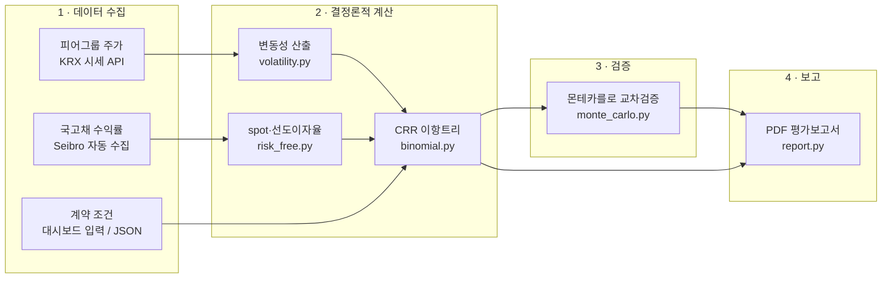

# 이항모형 기반 밸류에이션 자동화 (Binomial Model Valuation Automation)

콜옵션의 공정가치 평가를 **시장 데이터 수집부터 PDF 평가보고서까지 자동화**하는 프로젝트입니다.

계약조건과 피어그룹을 입력하면, 피어 주가와 국고채 수익률을 자동으로 수집해 변동성·무위험이자율을 산출하고, CRR 이항모형으로 평가한 뒤, 몬테카를로 시뮬레이션으로 교차검증하고, 평가보고서(PDF)를 생성합니다.

```bash
pip install -r requirements.txt
streamlit run app.py          # 웹 대시보드
```

옵션이 내재된 증권의 공정가치 평가는 실무에서 주로 엑셀로 수행되지만, 트리 스텝이 촘촘해지거나 전환가액 조정(리픽싱)·조기상환권 같은 조건이 붙으면 관리가 어렵고 느려집니다. 이 프로젝트는 평가 로직을 파이썬으로 구현하여 재현 가능하고 확장 가능한 평가 파이프라인을 만드는 것을 목표로 합니다.

> **배포**: Streamlit Community Cloud에 GitHub 저장소를 연결하면 push할 때마다 자동 재배포됩니다. 리눅스 배포 환경에 필요한 PDF 변환용 chromium과 한글 폰트는 `packages.txt`에 포함되어 있습니다.

---

## 1. 자동화 아키텍처

"사람은 판단만, 수집·계산·문서화는 자동"을 지향하는 **에이전틱 워크플로(Agentic Workflow)** 로 설계했습니다. AI 에이전트가 스킬에 정의된 표준 절차에 따라 전체 흐름을 조율하고, **모든 수치 계산은 재현 가능한 파이썬 파이프라인이 결정론적으로 수행합니다. AI는 절차 조율과 서술만 담당하며 평가 수치를 만들어내지 않습니다.**



### 계층별 구성

**① 데이터 수집 (Data Acquisition)** — 평가에 필요한 시장 데이터를 자동 확보합니다.

| 데이터 | 수집 방식 | 구현 |
|--------|-----------|------|
| 피어그룹 주가 | **API 연동** — FinanceDataReader로 KRX 일별 종가 수집 (5개사 1년치 약 4초) | `valuation/volatility.py` |
| 국고채 수익률 | **무료 공개 데이터 직접 호출** — Seibro(한국예탁결제원) 채권만기수익률을 HTTP 요청으로 수집. API 키·브라우저·토큰 불필요, 휴일이면 직전 영업일로 자동 소급 | `valuation/seibro.py` |
| 계약 조건 | 대시보드 직접 입력 또는 계약정보 JSON 첨부 (계약서 문서 → JSON 자동 추출은 로드맵) | `app.py` / `data/*.json` |

> KOFIA 채권정보센터는 공식 API가 없고 WAF가 스크립트 접근을 차단합니다(진단 완료). 동일 성격의 수익률을 무료 제공하는 Seibro를 기본 수집원으로 사용하며, KOFIA는 에이전트 브라우저 수집(스킬 2-B-a)을 폴백으로 유지합니다.

**② 결정론적 계산 (Deterministic Computation)** — 모듈들이 데이터 계약(JSON)으로 연결된 파이프라인입니다.

```
피어 주가 ──→ 로그수익률 ──→ 연환산 변동성 평균 ──┐
                                                  ├──→ CRR 이항트리 ──→ 1주당 가치
국고채 YTM ──→ spot 부트스트래핑 ──→ 선도이자율 ──┘    (스텝별 확률·할인)

콜옵션 수량 = 대상주식수량 × 행사범위 × 보유자별 행사비율
총 평가액 = 1주당 가치 × 콜옵션 수량
```

각 모듈의 산출물이 다음 모듈로 손실 없이 전달되는 것을 자동 테스트(pytest 73개)와 독립 재계산 진단으로 확인합니다. 같은 입력이면 항상 같은 결과가 나옵니다(난수 시드 고정 포함).

**③ 검증 (Verification)** — 계산 구조가 전혀 다른 몬테카를로 시뮬레이션으로 독립 재계산하여 95% 신뢰구간 합격 기준으로 판정하고, Black-Scholes 수렴·풋-콜 패리티 테스트가 상시 실행됩니다.

**④ 보고 (Reporting)** — 결과 JSON만을 수치 원천으로 삼아 PDF 평가보고서를 생성합니다. 가정·산출 근거·데이터 출처가 보고서에 상세 기재됩니다.

### AI 기술 용어

| 용어 | 의미 | 이 프로젝트에서의 적용 |
|------|------|------------------------|
| 에이전틱 워크플로 (Agentic Workflow) | AI 에이전트가 도구를 사용하며 다단계 작업을 자율 수행 | 스킬에 정의된 6단계 평가 절차를 에이전트가 조율 |
| 스킬 (Skill) | 에이전트에게 부여하는 표준작업절차(SOP) 문서 | `.claude/skills/valuation-report/SKILL.md` |
| API 연동 (API Integration) | 정해진 규약으로 데이터를 요청·응답 | FinanceDataReader → KRX 피어 주가, Seibro → 국고채 수익률 |
| 브라우저 자동화 (Browser Automation) | 에이전트가 실제 브라우저를 조작해 화면 데이터를 수집 | KOFIA 수집 폴백 (WAF 차단 대응) |
| 결정론적 파이프라인 (Deterministic Pipeline) | 같은 입력이면 항상 같은 출력 | `valuation/` 모듈 전체 — LLM의 확률적 생성과 분리 |
| 데이터 계약 (Data Contract) | 모듈 간 주고받는 데이터 형식의 약속 | 계약·입력·결과 JSON 구조 |
| 교차검증 (Cross-validation) | 독립적 방법으로 재계산해 신뢰성 확보 | 이항트리 vs 몬테카를로 (95% CI 판정) |
| 휴먼인더루프 (Human-in-the-loop) | 핵심 판단 지점에 사람의 확인을 배치 | 피어그룹 선정, 기초자산 가액 추정, 가정 승인 |
| 문서 정보 추출 (Document Extraction) | 비정형 문서에서 정형 데이터 추출 | (로드맵) 계약서 PDF → 계약정보 JSON |

---

## 2. 사용 방법

### 웹 대시보드

`streamlit run app.py` 실행 후, 왼쪽에 조건을 입력하고 **가치평가 실행**을 누르면 오른쪽 패널에 결과가 표시됩니다.

사용자가 입력하는 값과 자동으로 처리되는 부분은 다음과 같습니다.

| 사용자가 입력 | 자동으로 처리 |
|---------------|---------------|
| 계약조건 (계약명·당사자·기초자산·대상주식수량·행사가격·만기·행사방식) | 피어 주가 수집 → 변동성 산출·평균 |
| 콜옵션 조건 (행사범위, 보유자별 행사비율, 옵션 대가율) | Seibro 국고채 수익률 수집 → spot rate → 선도이자율 |
| 평가 주요변수 (평가기준일, 기초자산 가액, 배당 여부) | CRR 이항모형 평가 → 몬테카를로 교차검증 → 민감도 분석 |
| 피어그룹 (기업명·종목코드), 계산 설정 (할인 방식·트리 스텝·MC 경로 수) | PDF 평가보고서 생성 |

계약정보 JSON을 첨부하면 위 입력값의 기본값으로 채워집니다.

오른쪽 미리보기에는 핵심 지표(1주당 가치·총 평가액·교차검증 결과), 보고서 실물 미리보기, 변동성·선도이자율 산출 내역, 민감도 분석, 계산 과정 JSON이 표시되며, 결과 JSON과 PDF 보고서를 바로 내려받을 수 있습니다.

### 명령행 (CLI)

```bash
# 평가 실행 → 결과 JSON
python -m valuation.run_valuation --contract data/sample_contract.json \
    --inputs data/my_inputs.json --output-dir results

# 결과 JSON → PDF 평가보고서
python -m valuation.report --contract data/sample_contract.json \
    --result results/valuation_result_2026-06-30.json --output-dir reports

# 검증 테스트
python -m pytest tests
```

---

## 3. 이론적 배경: CRR 이항모형

Cox-Ross-Rubinstein(1979) 모형은 기초자산 주가가 매 단위기간 `dt`마다 일정 배수로 상승(`u`)하거나 하락(`d`)한다고 가정하고, 위험중립확률(`q`)로 만기 페이오프의 기대값을 역방향으로 할인하여 현재가치를 구합니다.

| 기호 | 의미 |
|------|------|
| `s0` | 평가기준일 현재 주가 |
| `sigma` | 주가 변동성 (연환산) |
| `maturity` | 만기까지 기간 (연 단위) |
| `steps` | 트리 스텝 수 (`dt = maturity / steps`) |
| `rf` | 무위험이자율 (연속복리) |
| `K` | 행사가격 (전환가액 등) |

```
u = exp(sigma · √dt)                # 주가 상승배수
d = 1 / u                           # 주가 하락배수
q = (exp(rf · dt) − d) / (u − d)    # 위험중립확률
할인계수 = exp(−rf · dt)            # 위험중립확률과 동일한 복리 기준으로 할인
```

스텝 수를 늘릴수록 결과는 Black-Scholes 해석해에 수렴하며, 이 성질을 구현 검증(수렴 테스트)에 사용합니다.

### 기간구조(선도이자율) 반영 — 실무 평가모델 방식

무위험이자율을 하나로 고정하지 않고, 수익률곡선에서 도출한 **스텝별 선도이자율**을 트리의 매 스텝에 적용할 수 있습니다 (`discounting: "term_structure"`). 스텝 `i`의 선도이자율은 할인계수 비율에서 도출됩니다.

```
1 + f_i = DF(t_{i-1}) / DF(t_i),   DF(t) = exp(−spot(t) · t)
q_i = (1 + f_i − d) / (u − d),     할인계수 = 1 / (1 + f_i)
```

실무 엑셀 평가모델의 계산 관행을 분석·학습한 내용은 [`docs/valuation-logic-notes.md`](docs/valuation-logic-notes.md)에 정리했습니다.

### 계약 조건 반영

실무 콜옵션 계약의 조건을 평가에 반영합니다.

- **행사범위 · 보유자별 행사비율**: 대상주식 중 콜옵션 대상이 되는 비율(행사범위)과, 그 대상을 여러 보유자가 나눠 갖는 비율(행사비율)을 받아 보유자별 수량·평가액과 합계를 산출합니다.
- **옵션 대가율(보장수익률)**: 행사 시점까지 연 `r%`의 수익률을 보장하는 계약에서는 행사가격이 시간에 따라 복리로 상승합니다. 이 경우 고정 행사가격 대신 시점별 행사가격 스케줄 `K(t) = 기준가 × (1 + r)^t`를 이항트리의 각 시점 노드에 적용합니다.

---

## 4. 설계 원칙

교과서적 구현(2차원 트리 행렬 + 이중 for문)은 이해하기 쉽지만 실무 자동화에는 비효율적이고 오류에 취약합니다. 이 프로젝트는 다음 원칙으로 구현했습니다.

**① 벡터화된 역방향 귀납 — 트리 행렬을 만들지 않는다**
`(T+1)×(T+1)` 행렬을 셀 단위로 채우는 대신, 만기 시점 주가 배열에서 출발해 배열 연산으로 한 스텝씩 뒤로 이동합니다. 메모리는 O(T²) → O(T)로 줄고 스텝 수가 수천이어도 빠릅니다. 보고서용 트리 표시가 필요할 때만 전체 트리를 생성합니다(`build_trees`).

**② 복리 기준의 일관성 — 확률과 할인은 같은 금리 관행을 쓴다**
위험중립확률을 `exp(rf·dt)`로 계산했다면 할인도 `exp(−rf·dt)`로 해야 합니다. 확률은 연속복리, 할인은 이산복리로 혼용하면 스텝 수가 커질수록 오차가 누적됩니다(실무 엑셀 모델에서 실제로 발견한 문제).

**③ 입력 검증 — 잘못된 입력은 계산 전에 실패시킨다**
양수 조건과 무차익거래 조건(`d < 성장배수 < u`, 즉 `0 < q < 1`)을 파라미터 생성 시점에 검증하고, 위반 시 잘못된 평가액을 조용히 내놓는 대신 즉시 예외를 발생시킵니다.

**④ 페이오프의 분리 — 모형과 증권 조건을 결합하지 않는다**
트리 엔진은 페이오프 함수를 인자로 받습니다. 콜/풋, 유럽형/미국형은 물론 CB/RCPS 페이오프도 엔진 수정 없이 함수 교체만으로 평가할 수 있습니다.

---

## 5. 검증 전략

몬테카를로 교차검증 결과는 평가보고서에 수록되어 이항모형 평가액의 신뢰성 근거로 제시됩니다.

- **몬테카를로 교차검증**: 동일한 위험중립 가정 하에서 경로 시뮬레이션으로 독립 계산. 이항모형 평가액이 MC 추정치의 **95% 신뢰구간 내**에 있는지를 합격 기준으로 하고, 경로 수·표준오차·신뢰구간을 보고서에 명시 (난수 시드 고정 + 대조변량으로 재현성 확보)
- **해석해 수렴 테스트**: 유럽형 콜/풋이 스텝 수 증가에 따라 Black-Scholes 해석해에 수렴하는지 확인
- **풋-콜 패리티**: `C − P = S0 − K·exp(−rf·T)` 성립 확인
- **경계 조건**: 변동성 0, 심내가격/심외가격 등 극단 입력에서의 기대값 확인
- **선도이자율 항등식**: `∏(1 + f_i) = 1 / DF(T)` 성립 확인
- **기존 평가모델 대사**: 실무 엑셀 평가모델과 동일 입력으로 결과 대사

교차검증은 계산 구조가 전혀 다른 두 기법(격자 기반 역방향 귀납 vs 경로 시뮬레이션)의 결과 일치를 보이는 것으로, **계산의 정확성**을 입증합니다. 이는 평가 가정 자체의 타당성 검증(변동성·할인율 등)과는 구분하여 보고서에 기술합니다.

---

## 6. 로드맵

**완료**

- [x] CRR 이항모형 엔진 (벡터화 역방향 귀납, 미국형 조기행사, 배당수익률)
- [x] 몬테카를로 교차검증 (유럽형, 대조변량, 95% CI 판정)
- [x] 변동성 자동 산출 (피어그룹 주가 API 수집 → 로그수익률 → 연환산 평균)
- [x] 국고채 수익률 자동 수집 (Seibro) → spot rate 부트스트래핑 → 잔존만기 보간
- [x] 기간구조 할인 (스텝별 선도이자율을 트리에 적용, 주 단위 트리 지원)
- [x] 계약 조건 반영 (행사범위, 보유자별 행사비율, 옵션 대가율에 따른 시점별 행사가격 스케줄)
- [x] PDF 평가보고서 자동 생성 (CRR 방법론·주요변수·보유자별 결과·트리·민감도 수록)
- [x] 웹 대시보드 (입력 → 실행 → 결과·보고서 미리보기 → 다운로드)
- [x] 검증 자동화 (pytest 73개 — 수렴·패리티·경계조건·교차검증·파이프라인·계약조건)
- [x] 평가 워크플로 스킬 + 외부평가업무 행동 강령 문서화

**진행 예정**

- [ ] **LSMC 확장**: Longstaff-Schwartz 회귀 기반 몬테카를로 — 미국형 조기행사 교차검증 및 리픽싱 등 경로의존 조건 평가
- [ ] **증권별 페이오프 확장**: CB(전환사채), RCPS(상환전환우선주)의 전환권·상환권·조기상환권
- [ ] **계약서 분석 에이전트**: 계약서(PDF/문서) 첨부 시 계약정보를 자동 추출·정형화(JSON)하여 평가부터 보고서까지 전 과정 자동 수행

---

## 7. 프로젝트 구조

평가 로직은 파이썬 스크립트가, 평가 실행 절차는 Claude Code 스킬이 담당합니다. 스크립트는 계산만 수행하고, 스킬이 입력 수집부터 결과 정리까지의 워크플로를 표준화합니다.

```
이항모형/
├── app.py                             # 웹 대시보드 (streamlit run app.py)
├── requirements.txt
├── valuation/                         # 평가 로직 (결정론적 계산)
│   ├── binomial.py                    #   CRR 트리 엔진 (price, price_with_curve, build_trees)
│   ├── monte_carlo.py                 #   몬테카를로 교차검증 (추후 LSMC 확장)
│   ├── payoffs.py                     #   페이오프 (콜/풋, 시점별 행사가격 스케줄)
│   ├── volatility.py                  #   피어그룹 주가 수집 및 변동성 산출
│   ├── seibro.py                      #   Seibro 국고채 만기수익률 자동 수집
│   ├── risk_free.py                   #   spot rate 부트스트래핑 · 선도이자율 산출
│   ├── run_valuation.py               #   평가 실행 진입점 (입력 → 평가 → 교차검증 → 민감도)
│   └── report.py                      #   평가보고서 생성 (결과 JSON → HTML → PDF)
├── tests/                             # 검증 테스트 (pytest 73개)
├── data/                              # 평가 입력 데이터
│   ├── sample_contract.json           #   가상 계약 데이터 (검증용)
│   ├── sample_ytm_curve.json          #   국고채 수익률 곡선 예시 (가상)
│   └── valuation_inputs_template.json #   평가 주요변수 입력 템플릿
├── docs/
│   ├── conduct-guidelines.md          #   외부평가업무 행동 강령 (보고서 필수 기재사항 등)
│   └── valuation-logic-notes.md       #   실무 평가모델 학습 노트 (비식별)
├── reports/                           # 산출된 평가보고서 PDF
└── .claude/skills/valuation-report/   # 가치평가~보고서 산출 워크플로 스킬
```
